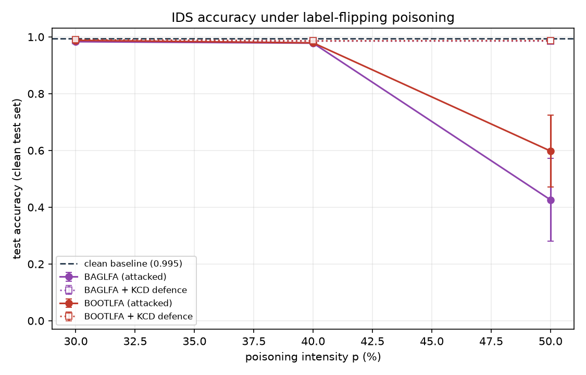
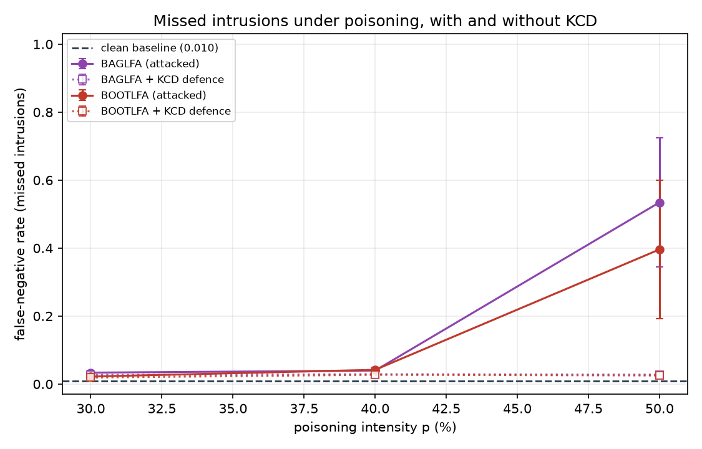
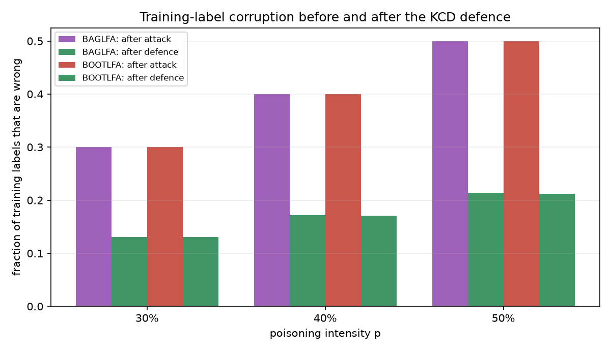

# Results

All numbers below are measured on a **clean held-out test set** (3,957 records,
20% of the dataset) that the attacker never touches, averaged over **3 seeds**
(42, 43, 44) and reported as mean ± standard deviation.

Reproduce with:

```bash
lfd-ids run -c configs/default.yaml --repeats 3 -o results
python scripts/make_report_tables.py results
```

**Setup.** 40 vehicles × 500 readings → 19,782 records after channel loss and
ingestion validation, balanced 50/50 benign/malicious. Feature vector: tyre
temperature, tyre pressure, latitude, longitude. Split 60/20/20; only the
**training** labels are poisoned. The IDS is the specified sequential MLP
(64-relu / 32-tanh / 16-relu / 8-tanh / 1-sigmoid, 3,073 parameters) trained
for 200 epochs with Adam, no early stopping — deliberately the *undefended*
pipeline the project is characterising.

Because the classes are balanced, **50% accuracy is exactly the random-guessing
floor**, which is what makes the collapse at p = 50% legible.

---

## 1. The main grid

| Scenario | Attack | Defence | p | Accuracy | Precision | Recall | F1 | FNR | AUC |
| --- | --- | --- | --- | --- | --- | --- | --- | --- | --- |
| baseline | — | — | 0% | 0.9945 ± 0.0004 | 0.9988 ± 0.0009 | 0.9902 ± 0.0009 | 0.9945 ± 0.0004 | 0.0098 ± 0.0009 | 0.9990 ± 0.0001 |
| attacked | BAGLFA | — | 30% | 0.9832 ± 0.0030 | 1.0000 ± 0.0000 | 0.9663 ± 0.0060 | 0.9829 ± 0.0031 | 0.0337 ± 0.0060 | 0.9954 ± 0.0017 |
| defended | BAGLFA | BAGKCD | 30% | 0.9864 ± 0.0016 | 0.9997 ± 0.0005 | 0.9732 ± 0.0031 | 0.9863 ± 0.0016 | 0.0268 ± 0.0031 | 0.9976 ± 0.0009 |
| attacked | BAGLFA | — | 40% | 0.9780 ± 0.0038 | 0.9957 ± 0.0057 | 0.9603 ± 0.0099 | 0.9776 ± 0.0040 | 0.0397 ± 0.0099 | 0.9894 ± 0.0017 |
| defended | BAGLFA | BAGKCD | 40% | 0.9853 ± 0.0009 | 0.9997 ± 0.0005 | 0.9710 ± 0.0020 | 0.9851 ± 0.0009 | 0.0290 ± 0.0020 | 0.9960 ± 0.0019 |
| attacked | BAGLFA | — | 50% | 0.4259 ± 0.1463 | 0.5837 ± 0.2963 | 0.4654 ± 0.1897 | 0.4369 ± 0.0659 | 0.5346 ± 0.1897 | 0.3830 ± 0.0033 |
| defended | BAGLFA | BAGKCD | 50% | 0.9855 ± 0.0016 | 0.9988 ± 0.0017 | 0.9722 ± 0.0040 | 0.9853 ± 0.0017 | 0.0278 ± 0.0040 | 0.9980 ± 0.0009 |
| attacked | BOOTLFA | — | 30% | 0.9878 ± 0.0026 | 0.9976 ± 0.0017 | 0.9779 ± 0.0067 | 0.9877 ± 0.0027 | 0.0221 ± 0.0067 | 0.9940 ± 0.0032 |
| defended | BOOTLFA | BOOTKCD | 30% | 0.9903 ± 0.0021 | 0.9998 ± 0.0002 | 0.9808 ± 0.0039 | 0.9902 ± 0.0021 | 0.0192 ± 0.0039 | 0.9970 ± 0.0016 |
| attacked | BOOTLFA | — | 40% | 0.9790 ± 0.0020 | 1.0000 ± 0.0000 | 0.9581 ± 0.0040 | 0.9786 ± 0.0021 | 0.0419 ± 0.0040 | 0.9823 ± 0.0077 |
| defended | BOOTLFA | BOOTKCD | 40% | 0.9863 ± 0.0021 | 0.9998 ± 0.0002 | 0.9727 ± 0.0042 | 0.9861 ± 0.0021 | 0.0273 ± 0.0042 | 0.9972 ± 0.0015 |
| attacked | BOOTLFA | — | 50% | 0.5979 ± 0.1262 | 0.6983 ± 0.2299 | 0.6038 ± 0.2038 | 0.5901 ± 0.1046 | 0.3962 ± 0.2038 | 0.6687 ± 0.1396 |
| defended | BOOTLFA | BOOTKCD | 50% | 0.9870 ± 0.0015 | 0.9993 ± 0.0010 | 0.9747 ± 0.0023 | 0.9869 ± 0.0016 | 0.0253 ± 0.0023 | 0.9961 ± 0.0019 |



### What this says

**The clean IDS works.** 99.45% accuracy, 0.98% false-negative rate, AUC
0.9990. That is the detector the fleet would ship.

**At p = 50% it collapses.** BAGLFA drives accuracy to 42.6% and BOOTLFA to
59.8% — either side of the random-guessing floor — with AUC at 0.383 and 0.669.
An AUC *below* 0.5 (BAGLFA) means the model has learned an actively inverted
ranking: it is worse than a coin flip. The false-negative rate rises from 1% to
**53%** (BAGLFA) and **40%** (BOOTLFA): roughly every second intrusion walks
straight through.

**Those p = 50% numbers are wildly unstable** — ±14.6 and ±12.6 points across
just three seeds, the largest variance anywhere in the grid. That is a finding,
not noise to average away. At exactly 50% inversion the training labels carry
no class signal at all, so what the model latches onto is whichever accidental
structure the poisoned labels happen to contain that run. A single-seed
experiment here would be close to meaningless, which is why the grid is run
three times.

**The defence restores the detector at every intensity**: 98.5–99.0% accuracy,
FNR back down to 2.5–2.9%, AUC ≥ 0.996. At p = 50% BAGKCD takes accuracy from
42.6% to 98.6% and cuts missed intrusions from 53% to 2.8% — a **19× reduction
in false negatives**, which is the number that matters for a safety system.

**Between 30% and 40% the attack barely bites, and so the defence has little to
undo** (98.3% → 98.6% for BAGLFA at p = 30%). Section 3 explains why, and why
that is not the reassurance it looks like.



---

## 2. How much of the poisoning the defence actually undoes

| Attack | Defence | p | Label error before | after | Flips corrected | Newly corrupted | Cluster mapping |
| --- | --- | --- | --- | --- | --- | --- | --- |
| BAGLFA | BAGKCD | 30% | 0.300 | 0.130 | 57.7% | 40 | majority |
| BAGLFA | BAGKCD | 40% | 0.400 | 0.171 | 58.0% | 38 | majority |
| BAGLFA | BAGKCD | 50% | 0.500 | 0.214 | 57.7% | 30 | anchor |
| BOOTLFA | BOOTKCD | 30% | 0.300 | 0.130 | 57.7% | 43 | majority |
| BOOTLFA | BOOTKCD | 40% | 0.400 | 0.171 | 58.0% | 36 | majority |
| BOOTLFA | BOOTKCD | 50% | 0.500 | 0.212 | 58.1% | 29 | anchor |

KCD corrects a **strikingly consistent ~58% of the adversary's flips**,
regardless of attack or intensity. That number is not a coincidence — it is
structural. KCD only rewrites labels of samples lying within the mean distance `μ` of
their cluster centroid, and that shell holds a measured **56.3%** of the
training set — close to the ~54% a Gaussian cluster in 4-D would give.
**The published relabelling rule therefore has a hard ceiling: it can never
repair more than about three-fifths of the damage**, no matter how good the
clustering is. The 58% correction rate is that ceiling, not a tuning outcome.

The residual label error after the defence is 13% (p = 30%), 17% (p = 40%) and
21% (p = 50%). The defence also *introduces* a few errors of its own — 29 to 43
training labels out of 11,869, well under half a percent — where a sample near
a centroid genuinely belonged to the other class.

So how does a training set still carrying 21% wrong labels produce a 98.6%
detector? Because of **where** the errors are. The repaired core of each
cluster is clean; what remains corrupted is the sparse outer shell, which the
default `outer_policy: drop` removes from the retraining set entirely. Section
4 measures exactly what that choice is worth.

**Cluster-to-class mapping** switches rule at p = 50%, as designed: at 30% and
40% the majority vote inside each cluster is still decisive, so `majority`
fires; at 50% the vote is a coin flip and the defence falls back to the trusted
`anchor` set. Without that fallback the defence is unreliable at exactly 50% —
Section 5 quantifies just how unreliable.



---

## 3. Random flipping is far weaker than it looks

The grid shows only a 1.6-point drop at p = 30%. That is not a flaw in the
attack implementation — it is a real and well-understood property of
**symmetric** label noise.

If the adversary flips labels uniformly at random, then while fewer than half
of them flip, the *majority* label in every region of feature space is still
the correct one. The Bayes-optimal decision boundary does not move. A
classifier that does not overfit will find roughly the same boundary it would
have found on clean data. The damage that does appear at 30–40% comes from the
model memorising individual noisy labels late in training, not from the
boundary shifting.

**That robustness evaporates the moment the adversary aims.** Restricting the
same flip budget to one direction (`attack.selection=malicious_to_benign`)
makes the noise *asymmetric*, which does move the boundary. Full 3-seed run at
the default scale (`results/ablation_directed_m2b/`), attacked accuracy:

| Selection | Attack | p = 30% | p = 40% | p = 50% |
| --- | --- | --- | --- | --- |
| `random` (uniform) | BAGLFA | 0.9832 ± 0.0030 | 0.9780 ± 0.0038 | 0.4259 ± 0.1463 |
| `random` (uniform) | BOOTLFA | 0.9878 ± 0.0026 | 0.9790 ± 0.0020 | 0.5979 ± 0.1262 |
| `malicious_to_benign` | BAGLFA | **0.5060 ± 0.0025** | **0.5010 ± 0.0007** | **0.5000 ± 0.0003** |
| `malicious_to_benign` | BOOTLFA | **0.5106 ± 0.0082** | **0.5023 ± 0.0024** | **0.5000 ± 0.0003** |

A directed attacker puts the IDS on the random-guessing floor at **p = 30%** —
the damage uniform flipping needs 50% to achieve — and it gets there with
almost no seed-to-seed variance (±0.003 against the random attack's ±0.15).
The directed attack is not just stronger, it is *reliable*: it removes the
class signal deterministically rather than hoping the noise lands badly.

**The practical takeaway is that poisoning intensity alone is a poor threat
measure.** At p = 30% an operator watching accuracy would see a healthy 98.3%
detector under the random attack and a coin flip under the directed one, from
an adversary spending exactly the same budget.

The defence handles the directed attack just as well, at every intensity:

| Defence | p = 30% | p = 40% | p = 50% |
| --- | --- | --- | --- |
| BAGKCD | 0.9857 ± 0.0011 | 0.9859 ± 0.0016 | 0.9861 ± 0.0012 |
| BOOTKCD | 0.9848 ± 0.0004 | 0.9855 ± 0.0014 | 0.9854 ± 0.0006 |

This makes sense given how KCD works: it never looks at the labels to decide
*where* the classes are, only at the feature geometry. Which labels the
adversary chose to flip is therefore largely irrelevant to it.

---

## 4. What the defence's design choices are worth

KCD relabels only inside the mean-distance shell, which leaves the outer shell
holding whatever labels the adversary left. `defence.outer_policy` decides what
happens to those samples, and it is the single most consequential
implementation decision in the project. Defended accuracy, 3 seeds at full
scale:

| `outer_policy` | Attack | p = 30% | p = 40% | p = 50% |
| --- | --- | --- | --- | --- |
| `keep` (literal relabel-only rule) | BAGLFA | 0.9809 ± 0.0007 | 0.9714 ± 0.0031 | **0.8512 ± 0.0304** |
| `keep` | BOOTLFA | 0.9852 ± 0.0040 | 0.9633 ± 0.0094 | **0.8882 ± 0.0305** |
| `downweight` (weight 0.25) | BAGLFA | 0.9881 ± 0.0010 | 0.9737 ± 0.0050 | 0.9164 ± 0.0018 |
| `downweight` | BOOTLFA | 0.9874 ± 0.0007 | 0.9763 ± 0.0045 | 0.9653 ± 0.0091 |
| **`drop` (default)** | BAGLFA | 0.9864 ± 0.0016 | 0.9853 ± 0.0009 | **0.9855 ± 0.0016** |
| **`drop`** | BOOTLFA | 0.9903 ± 0.0021 | 0.9863 ± 0.0021 | **0.9870 ± 0.0015** |

The ordering is monotonic and the gap widens with the poisoning intensity.
**Reading the published rule literally — relabel the core, keep the rest —
recovers only 85.1% and 88.8% at p = 50%**, against 98.6% and 98.7% for
`drop`: a 10 to 13 point difference. `drop` is also an order of magnitude more
stable across seeds (±0.002 against ±0.030).

The reasoning is straightforward. KCD has no basis for trusting the labels
beyond `μ` — that is precisely why it declined to rewrite them. Feeding them to
the retrainer as if they were ground truth is worse than treating them as
unusable. Dropping them costs 4,926 of 11,869 training rows (the defence keeps
6,943, the 56.3% lying within `μ`) and is still the better trade by a wide
margin. `downweight` sits where you would expect, between the two.

**What the defence costs when there is no attack.** Running KCD on a completely
clean training set (`attack.intensities=0.0`, `results/ablation_no_attack/`)
gives 98.57% (BAGKCD) and 98.64% (BOOTKCD) against the 99.45% baseline — a cost
of **0.82 to 0.88 accuracy points**, with the false-negative rate rising from
0.98% to 2.7–2.9%. That is a real but small price, and it is cheap enough that
the defence can be left permanently enabled rather than switched on when
poisoning is suspected — which matters, because in practice you do not know
when you are being poisoned.

---

## 5. Without a trusted anchor set, the defence is a coin flip at p = 50%

Cluster-to-class assignment is where KCD is most fragile. The default `auto`
rule uses the majority vote of the poisoned labels inside each cluster while
that vote is decisive, and falls back to a small trusted anchor set when it is
not. Forcing majority-vote-only with no anchors at all
(`defence.label_assignment=majority`, `defence.trusted_fraction=0.0`,
`results/ablation_majority_only/`) shows why the fallback exists:

| Defence | p = 30% | p = 40% | p = 50% |
| --- | --- | --- | --- |
| BAGKCD, majority only | 0.9694 ± 0.0024 | 0.9710 ± 0.0018 | **0.4923 ± 0.3623** |
| BOOTKCD, majority only | 0.9528 ± 0.0151 | 0.9590 ± 0.0078 | **0.5040 ± 0.3750** |
| *(default, with anchors)* | *0.986–0.990* | *0.985–0.986* | *0.986–0.987* |

A ±0.36 standard deviation is not a noisy average — it is a **trimodal
outcome**. The per-seed results at p = 50%:

| Seed | Attack | Cluster mapping | Vote margin | Accuracy |
| --- | --- | --- | --- | --- |
| 44 | BOOTLFA | `{0→0, 1→1}` correct | 0.0085 / 0.0004 | 0.9654 |
| 42 | BAGLFA | `{0→0, 1→0}` degenerate | 0.0025 / 0.0005 | 0.9320 |
| 43 | BOOTLFA | `{0→0, 1→0}` degenerate | 0.0123 / 0.0091 | 0.4999 |
| 43 | BAGLFA | `{0→1, 1→1}` degenerate | 0.0132 / 0.0102 | 0.5001 |
| 42 | BOOTLFA | `{0→1, 1→1}` degenerate | 0.0016 / 0.0005 | 0.0468 |
| 44 | BAGLFA | `{0→1, 1→0}` **inverted** | 0.0104 / 0.0040 | **0.0447** |

Every vote margin is under 1.4% — these are exact coin flips, as expected when
half the labels in every cluster have been inverted. In four of six runs the
vote is *degenerate*, mapping both clusters to the same class; in one it is
cleanly **inverted**, and the defence relabels the core backwards, driving the
detector to 4.5% accuracy with a 91% false-negative rate.

**That is worse than the attack it was meant to repair** (42.6%). A defence
that can invert the detector is not a partial defence — under this
configuration it is a second attack. The 5% trusted anchor set is what
converts KCD from a coin flip into the 98.6% result in Section 1, and it is
the assumption most worth scrutinising before trusting this method in
practice.

---

## 6. The ensemble aggregator makes things worse under heavy poisoning

Both attacks also train the per-subset models `M₁..M_B` and their aggregator,
as the architecture specifies:

| Attack | p | Aggregation | Members | Mean member accuracy | Aggregated accuracy | Single model on D′ |
| --- | --- | --- | --- | --- | --- | --- |
| BAGLFA | 30% | majority_vote | 10 | 0.9868 ± 0.0035 | 0.9910 | 0.9832 |
| BAGLFA | 40% | majority_vote | 10 | 0.9651 ± 0.0121 | 0.9805 | 0.9780 |
| BAGLFA | 50% | majority_vote | 10 | 0.2991 ± 0.1130 | 0.2414 | 0.4259 |
| BOOTLFA | 30% | soft_average | 10 | 0.9892 ± 0.0029 | 0.9933 | 0.9878 |
| BOOTLFA | 40% | soft_average | 10 | 0.9721 ± 0.0092 | 0.9896 | 0.9790 |
| BOOTLFA | 50% | soft_average | 10 | 0.4899 ± 0.1308 | 0.3730 | 0.5979 |

At 30% and 40% the aggregator behaves exactly as ensemble theory predicts —
voting beats the single model (99.10% vs 98.32% for BAGLFA at 30%; 98.96% vs
97.90% for BOOTLFA at 40%), because member errors are partly independent and
cancel.

**At 50% that reverses, sharply.** The BAGLFA aggregator scores 24.1% against
the single model's 42.6%, and BOOTLFA's 37.3% against 59.8%. Ensembling makes
the poisoned detector *worse than one model trained on the same poisoned data*.
The reason is that every member is trained on views of the **same** corrupted
label set, so their errors are correlated rather than independent — and voting
over correlated errors amplifies them instead of cancelling them. Bagging is
not a defence against label poisoning; under heavy poisoning it is a liability.

---

## 7. Detection by attack type

Per-attack-type recall on the clean baseline, from
`results/experiment_report.json` (`extras.per_attack_recall`):

| Attack type | What it forges | Records | Baseline recall |
| --- | --- | --- | --- |
| `fuzzing` | sensor values driven to their rails | 1,998 | 0.9955 |
| `thermal_injection` | impossible tyre temperature, decoupled pressure | 1,942 | 0.9933 |
| `replay_freeze` | stale frame replayed while the vehicle moves | 2,024 | 0.9920 |
| `gps_spoofing` | position displaced outside the operating region | 1,996 | 0.9857 |
| `tpms_deflation_spoof` | pressure collapse while temperature climbs | 1,938 | 0.9850 |

Every attack type is detected above 98.5%, but the spread is not arbitrary.
The easiest are the crude ones — fuzzing drives sensors to their rails, and
thermal injection reports temperatures no tyre can reach; both are detectable
from a single feature.

The two hardest, by a clear margin, are the TPMS deflation spoof (0.9850) and
GPS spoofing (0.9857) — and the deflation spoof is the most physically
plausible forgery of the five. It keeps every sensor inside its own valid
range and violates only the *relationship* between temperature and pressure.
Nothing about any single reading looks wrong; the record is only anomalous
jointly. That is precisely the structure the MLP has to learn, and it is where
the stealthy variants (`stealth_fraction`, blended back towards benign values)
land. **A more capable adversary would concentrate on exactly this kind of
physically-consistent forgery rather than the rail-slamming ones.**

---

## 8. Limitations

- **The dataset is simulated.** No public connected-vehicle capture with this
  exact feature set was available, so Module 1 generates one from a physical
  model of tyre behaviour. It is calibrated to be realistic and to give the
  >99% clean baseline the project specifies, but it is not a field capture.
  `lfd-ids run --csv <file>` swaps in a real one.
- **KCD assumes the classes are recoverable as two clusters.** The entire
  defence rests on k-means (k = 2) finding the benign/malicious split in
  feature space. Where classes are multi-modal or heavily overlapping, cluster
  assignment degrades and the repair degrades with it. This is a property of
  the published method, not of this implementation.
- **Validation and test labels are never poisoned**, matching the threat model
  (the attack targets training data). The defender is assumed to hold a clean
  holdout for model selection and a 5% trusted anchor set for cluster-to-class
  assignment. The anchor set is what makes the defence work at exactly
  p = 50% (Section 5), and it is the assumption most worth scrutinising: an
  operator who cannot obtain even a small attested sample cannot rely on this
  defence at high poisoning intensity.
- **Three seeds is few** for the p = 50% cells, where the standard deviation
  reaches ±15 points. The direction of the effect is unambiguous; the exact
  value is not.

---

## Appendix: files

| File | Contents |
| --- | --- |
| `results/results.csv` | one row per (scenario, attack, defence, intensity, seed) |
| `results/summary.csv` | the same, averaged across seeds |
| `results/experiment_report.json` | full detail: poison metadata, defence internals, label recovery, per-attack recall, deployment log |
| `results/figures/` | the six figures referenced above |
| `results/ablation_*/` | the ablation runs behind Sections 3 and 4 |
